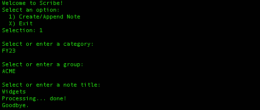
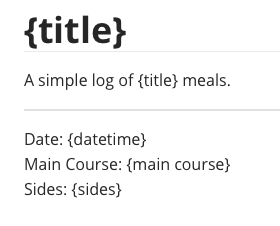

# Scribe

Scribe is an automated markdown generator written in Python. This utility leverages templates to provide the ability to generate and organize markdown notes directly from the command line in a matter of seconds.  Avoid frustratingly slow IDE editors and their cumbersome GUI interfaces. Fully customizable templates allows you to create pre-formatted notes quickly and easily!

 

1. [Overview](#overview)
2. [Requirements](#requirements)
3. [Installation](#installation)
3. [Operation](#operation)
3. [Templates](#templates)
3. [Variables](#variables)
4. [Configuration](#configuration)

- - -

#### Overview

[Back to Top](#scribe)

* Compatible with Windows, Linux and MacOS
* This Python3 utility simply creates [markdown](https://en.wikipedia.org/wiki/Markdown) files one the fly... it is NOT a markdown editor.  The [Requirements](#requirements) section has some third party WYSIWYG recommendations.  If you have any suggestions feel free to email them to me.  I'll be happy to review and consider adding it to my list.
* Following the '*Less Is More*' way of thinking, Scribe limits folder nesting to two levels.  This can be changed through the config file by updating the 'classifications' setting.
* The first time Scribe runs, it will prompt you for where you wish to create your notes.  Make sure this folder alreday exists beforehand.

- - -

#### Requirements

[Back to Top](#scribe)

This utility is a Python3 script.  Make sure the following requirements have been installed:

* [Python3](https://www.python.org/downloads/)
* [PyYAML](https://pyyaml.org/)

A WYSIWYG markdown editor is highly recommended.  Below are two worth considering:

> #####  [Typora](https://typora.io/)
>
> This little app is available on Windows, Mac and Linux. The interface is minimalistic with no toolbar to clutter your screen.  All text formatting is driven by menu options or keyboard shortcuts.  This may sound  intimidating at first, but after spending 10-15 minutes with it you'll be creating markdown notes in no time.
>
> Price: $14.99 with 14 day trial.

> #####  [UNotes](https://marketplace.visualstudio.com/items?itemName=ryanmcalister.Unotes)
>
> This is a plugin for VS Code.  If you're a developer looking for a better way to manager your README files, give UNotes a try.  The interface is inutitive and has nice features like inline embedding of images.
>
> Price: FREE!

- - -

#### Installation

[Back to Top](#scribe)

This is a command line interface (CLI) tool.  CLIs offer the ability to do repetitve tasks more efficiently and faster than a GUI interface because there's only a single device to interact with, the keyboard.  Nonetheless, users must be familiar with their operating system's [terminal](https://itconnect.uw.edu/learn/workshops/online-tutorials/web-publishing/what-is-a-terminal/) app. VS Code users can run this utility app directy from the IDE's built in terminal pane for a unified system of engagement. To install, make sure Python3 and PyYAML is installed (noted above) then follow the below 3-step process:

1. Navigate to the directory of your choice from your terminal app. An example would be:
   `cd /Users/jsmith/Documents/Projects`

2. Run the following GIT command:
   `git clone https://github.com/tedweb/scribe.git`
   This will download the project file into the directory from step one.  The output should read siliar to this:

3. Scribe is now operational.  Run the following command to execute:
   `python3 scribe.py`

**Special Note:** The first run will prompt you to enter the path of where you would like to keep your notes. It is strongly recommended to keep notes in a seprate folder away from where Scribe is installed. I personally prefer to keep them in a folder called 'Notes' within my 'Documents' folder.

**Desktop Shortcuts:**  Desktop shortcuts offer an easy way to launch Scribe.  However, the process of creating shortcuts can vary depending which operating system you are using (Mac, Linux or Windows), it's simply a matter of run-in command from a scriptable file:

`python3 ~/Documents/Projects/Scribe/scribe.py`

------

#### Operation

Running the command mentioned above will prompt you with a set of questions.  Primarily, which folder to keep your note and what do you want to call your note.  By default, folders are managed in a unified two level classification (categories & groups).  This is a by design to keep navigation in a consistent fashion which is key to simplifynig repetitive tasks.  Classifications can be changed to your liking within the config file.

###### 

At this point, your note has been created! You are now ready to start using the WYSIWYG editor of your choice to append and edit your notes!

Here's a screenshot of the Typora interface.

###### 

Here's a screenshot of the UNotes + VSCode interface.

###### 

------

#### Templates

Templates can be created and saved within the 'templates' folder of where Scribe resides.  This allows you to automatically apply a custom format to your markdown note depending upon where your note is created. Defining custom templates is a two step process:

1. Create template (in markdown format) and save within the 'scribe/templates' folder.
2. Reference template from the config file.

Scribe will determine which template to apply based upon the which folder you select to save your note. 

###### 

In the screenshot above, the 'opportunity.md' template will be applied to notes created in the FY21, FY22, FY23 sub-folders.

------

#### Variables

Variables can be defined within the templates. Defining custom templates is a two step process:

1. Create template using curly braces to denote varables.  For example, a variable titled 'amount' would be entered as {amount} within the template.
2. Reference variable and default value from the config file.

###### 

In the screenshot above, a variable names 'amount' is defined with a default of '0.00'.  This requires the template to reference the variable using curly braces (see below).

###### 

Scribe will promt user to enter a value (or press return to accept default value) for all variables from the command line.

- - -

#### Configuration

[Back to Top](#scribe)

The `config.yml` file is a YAML file allowing for customizations of the app.  Current customization features include:

* `ignore`: Folders to ignore and prevent from displaying.
* `working_directory`: Where your note files are kept.
* `classifications`:  This defines the unifying folder structure to organize your notes
* `template`: Custom templates can be created and assigned to specific directories within your notes folder.
* `variables`: Templates can contain variables with default values.